# คู่มือการใช้งานระบบจัดการไฮไลต์

## 1. แนะนำระบบ
ระบบการจัดการไฮไลต์ โดยผู้ใช้สามารถเพิ่ม แก้ไข และลบไฮไลต์ได้ตามต้องการ นอกจากนี้ยังรองรับการจัดการแท็กเพื่อจัดหมวดหมู่เนื้อหาได้ง่ายขึ้น ของ มหาวิทยาลัยขอนเเก่น คณะวิทยาลัยการคอมพิวเตอร์

---

## 2. การเข้าสู่ระบบและออกจากระบบ

### 2.1 การเข้าสู่ระบบ
1. ไปที่หน้าเว็บไซต์ของระบบ
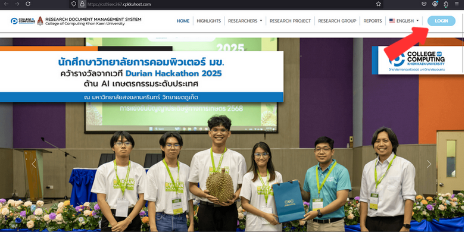
2. คลิกปุ่ม **Login** ที่มุมขวาบนของหน้าจอ  

3. กรอก **Username** และ **Password** แล้วกด **LOG IN** 
4. หากลืมรหัสผ่าน ให้ติดต่อผู้ดูแลระบบ

### 2.2 การออกจากระบบ
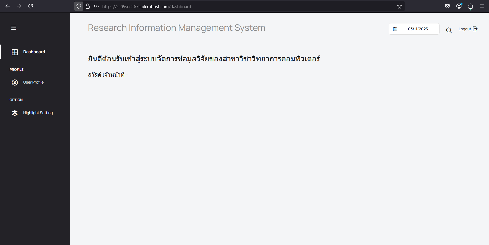
1. คลิกที่ไอคอน **Logout** บริเวณมุมขวาบน  
2. ระบบจะนำคุณกลับไปยังหน้าหลัก

---

## 3. การตั้งค่าโปรไฟล์

### 3.1 การเปลี่ยนรูปโปรไฟล์

1. ไปที่ **User Profile**
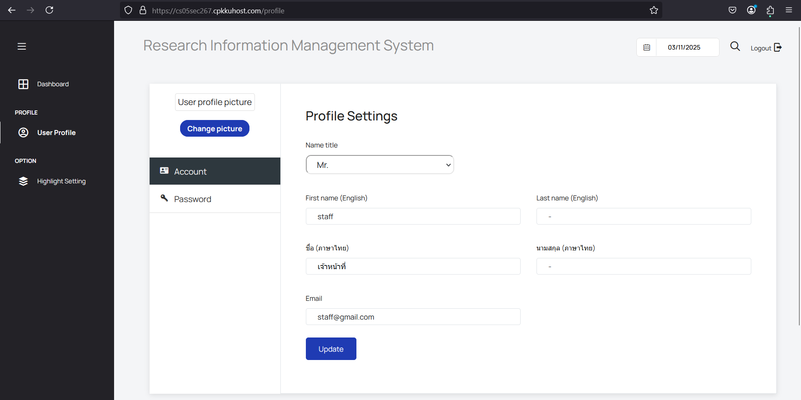
2. คลิก **Change Picture** ควรเป็น .png, .jpeg, .svg, .avif, .webp
3. อัปโหลดรูปภาพใหม่ แล้วกด **Update**  

### 3.2 การแก้ไขข้อมูลส่วนตัว
1. ไปที่ **User Profile**

2. แก้ไขข้อมูล เช่น ชื่อ อีเมล
3. กด **Update** เพื่อบันทึกการเปลี่ยนแปลง  

### 3.3 การเปลี่ยนรหัสผ่าน
1. ไปที่ **User Profile > Password**
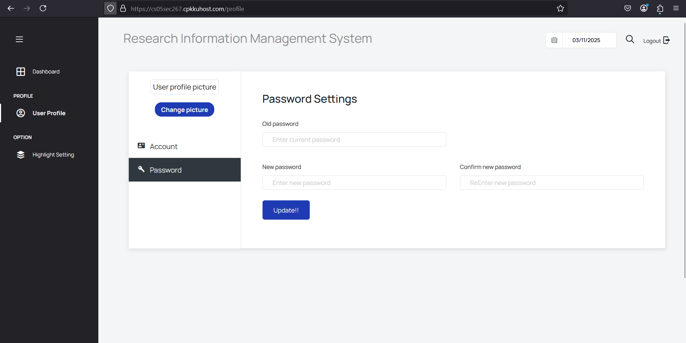
2. ป้อนรหัสผ่านเดิม และรหัสผ่านใหม่
3. กด **Update** เพื่อเปลี่ยนรหัสผ่าน  

---

## 4. การจัดการไฮไลต์

### 4.1 การสร้างไฮไลต์ใหม่
1. ไปที่ **Highlight Setting**
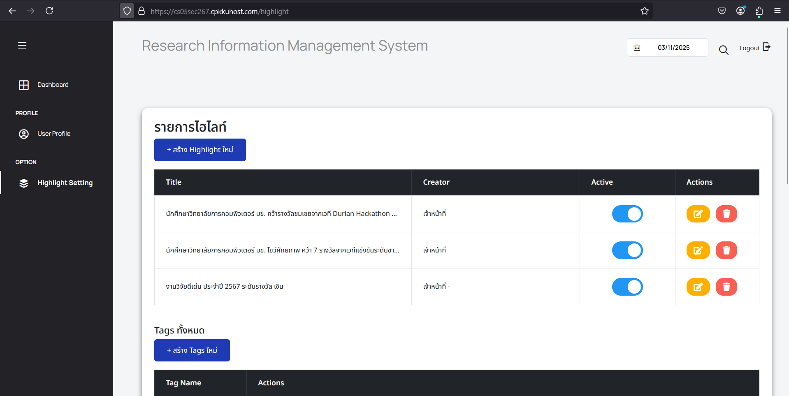
2. คลิก **+ สร้าง Highlight ใหม่**  
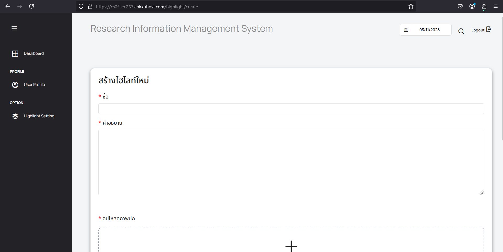
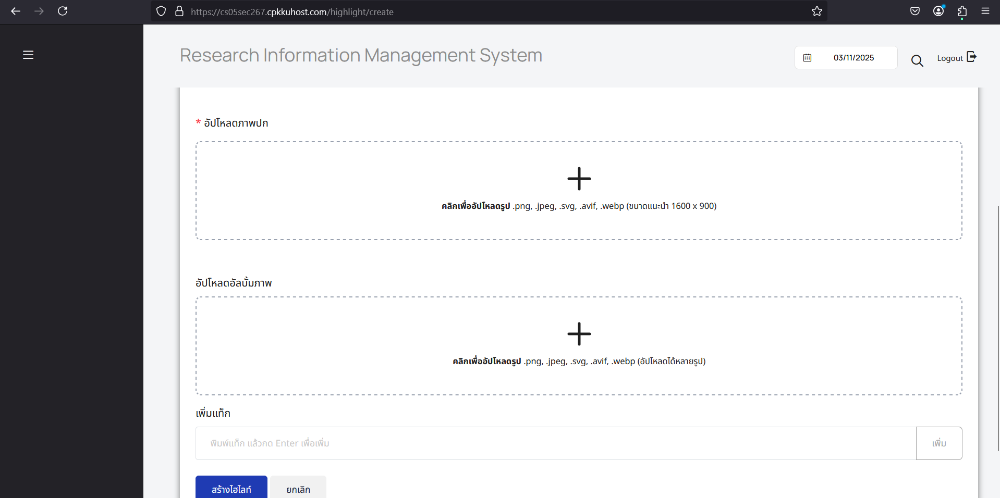
3. กรอกข้อมูล เช่น ชื่อ คำอธิบาย และอัปโหลดรูปภาพ  
   - **ขนาดแนะนำสำหรับภาพปก:** ควรเป็น .png, .jpeg, .svg, .avif, .webp (ขนาดแนะนำ 1600 x 900)
   - **ขนาดแนะนำสำหรับอัลบั้มภาพ:** ควรเป็น .png, .jpeg, .svg, .avif, .webp (อัปโหลดได้หลายรูป)
4. กด **สร้างไฮไลต์** เพื่อบันทึก

### 4.2 การแก้ไขไฮไลต์

1. ไปที่ **Highlight Setting**
2. ค้นหาไฮไลต์ที่ต้องการแก้ไข แล้วกดปุ่ม **แก้ไข**  
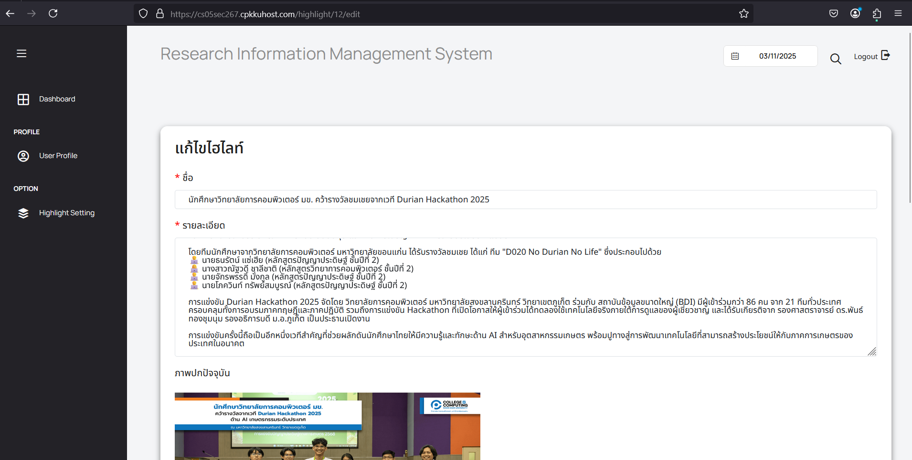
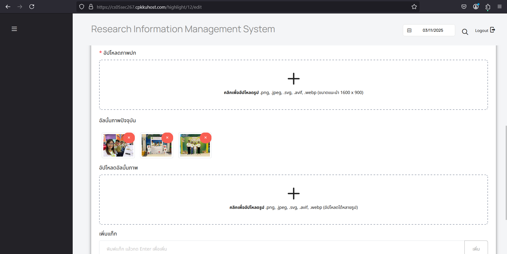
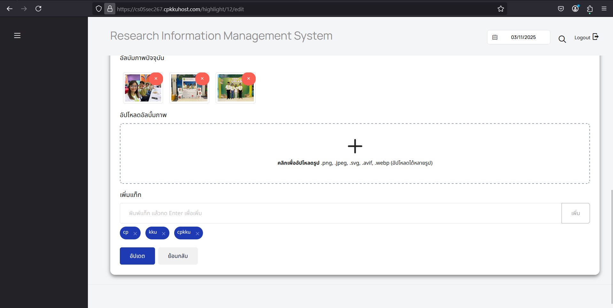
3. ปรับเปลี่ยนข้อมูล แล้วกด **อัปเดต**

### 4.3 การลบไฮไลต์
1. ไปที่ **Highlight Setting**

2. ค้นหาไฮไลต์ที่ต้องการลบ แล้วกดปุ่ม **ลบ**  
3. ยืนยันการลบเพื่อดำเนินการ

### 4.4 การตั้งค่าให้แสดงไฮไลด์
1. ไปที่ **Highlight Setting**

2. ค้นหาไฮไลต์ที่ต้องการลบ แล้วกดปุ่ม **Active**  
3. ยืนยันการลบเพื่อดำเนินการ

---

## 5. การจัดการแท็ก

### 5.1 การสร้างแท็กใหม่
1. ไปที่ **Highlight Setting**

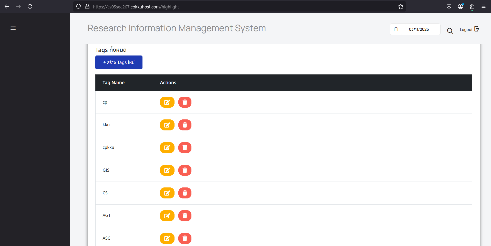
2. คลิก **+ สร้าง Tags ใหม่**  
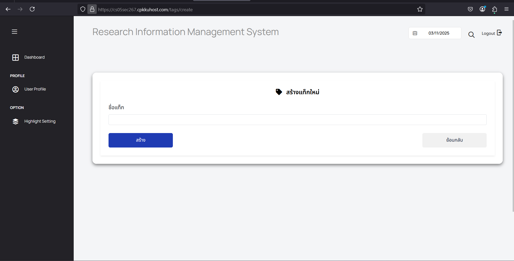
3. กรอกชื่อแท็ก แล้วกด **สร้าง**

### 5.2 การแก้ไขแท็ก
1. ไปที่ **Highlight Setting**
2. ค้นหาแท็กที่ต้องการแก้ไข แล้วกดปุ่ม **แก้ไข**  

3. ปรับเปลี่ยนข้อมูล แล้วกด **อัปเดต**

### 5.3 การลบแท็ก
1. ไปที่ **Highlight Setting**

2. ค้นหาแท็กที่ต้องการลบ แล้วกดปุ่ม **ลบ**  
3. ยืนยันการลบเพื่อดำเนินการ

---

## 6. การแก้ไขปัญหาเบื้องต้น
- **ลืมรหัสผ่าน**: ติดต่อผู้ดูแลระบบเพื่อขอรีเซ็ตรหัสผ่าน
- **ไม่สามารถเข้าสู่ระบบได้**: ตรวจสอบว่ากรอก Username และ Password ถูกต้อง
- **อัปโหลดรูปภาพไม่ได้**: ตรวจสอบว่าไฟล์มีขนาดและรูปแบบที่รองรับ (.png, .jpeg, .svg, .avif, .webp)